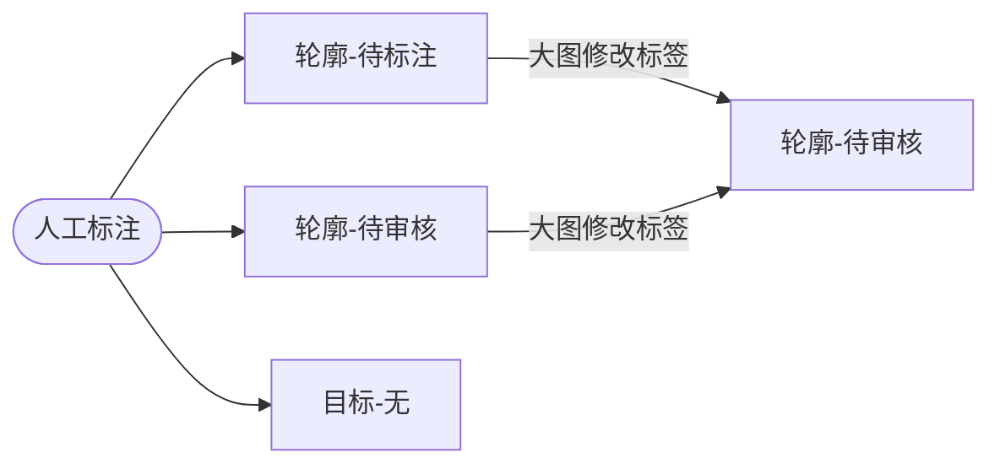
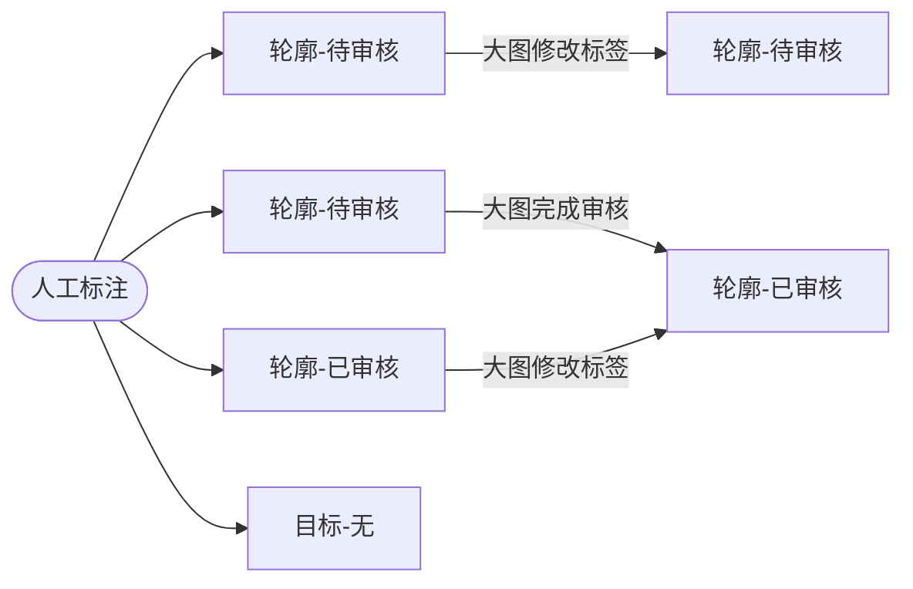
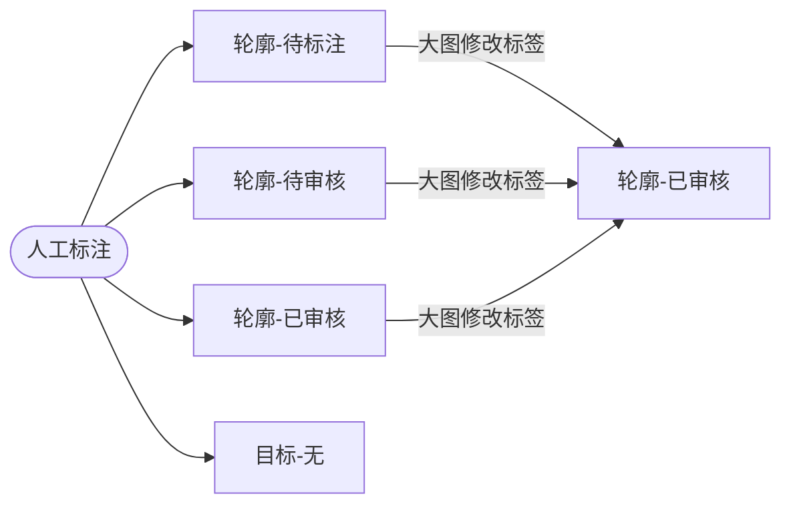
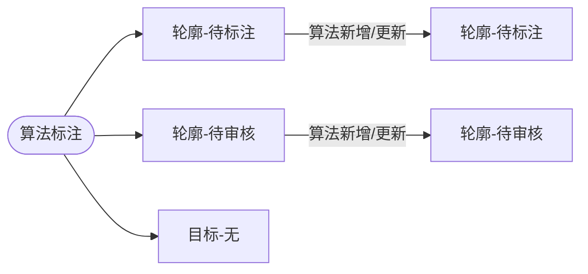
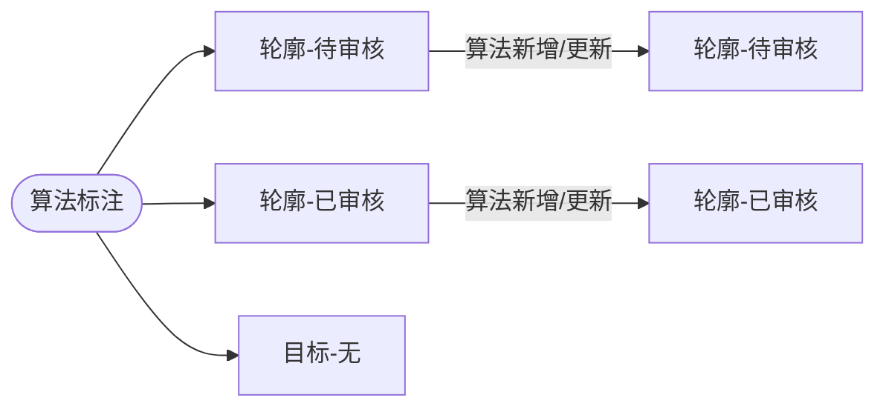
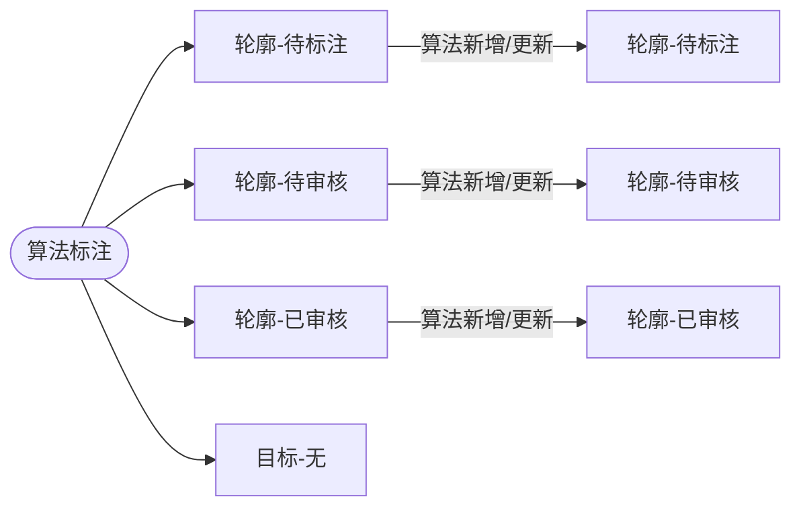

### 人工标注

#### 标注界面

```mermaid
flowchart LR
    start([人工标注]) --> 轮廓-待标注 --大图修改标签--> 1[轮廓-待审核]
    start([人工标注]) --> 2[轮廓-待审核] --大图修改标签--> 1[轮廓-待审核]
    start([人工标注]) --> 目标-无
```

#### 审核界面

```mermaid
flowchart LR
    start([人工标注]) --> 1[轮廓-待审核] --大图修改标签--> 2[轮廓-待审核]
    start([人工标注]) --> 3[轮廓-待审核] --大图完成审核-->4[轮廓-已审核]
    start([人工标注]) --> 5[轮廓-已审核] --大图修改标签-->4[轮廓-已审核]
    start([人工标注]) --> 目标-无
```

#### 归档界面
- 仅具有审核权限的人可以修改标签

```mermaid
flowchart LR
    start([人工标注]) --> 1[轮廓-待标注] --大图修改标签--> 2[轮廓-已审核]
    start([人工标注]) --> 3[轮廓-待审核] --大图修改标签--> 2[轮廓-已审核]
    start([人工标注]) --> 4[轮廓-已审核] --大图修改标签-->2[轮廓-已审核]
    start([人工标注]) --> 目标-无
```

### 算法标注

#### 标注界面

```mermaid
flowchart LR
    start([算法标注]) --> 轮廓-待标注 --算法新增/更新--> 1[轮廓-待标注]
    start([算法标注]) --> 轮廓-待审核 --算法新增/更新--> 2[轮廓-待审核]
    start([算法标注]) --> 目标-无
```

#### 审核界面

```mermaid
flowchart LR
    start([算法标注]) --> 轮廓-待审核 --算法新增/更新--> 1[轮廓-待审核]
    start([算法标注]) --> 轮廓-已审核 --算法新增/更新--> 2[轮廓-已审核]
    start([算法标注]) --> 目标-无
```

#### 归档界面

```mermaid
flowchart LR
    start([算法标注]) --> 轮廓-待标注 --算法新增/更新--> 1[轮廓-待标注]
    start([算法标注]) --> 轮廓-待审核 --算法新增/更新--> 2[轮廓-待审核]
    start([算法标注]) --> 轮廓-已审核 --算法新增/更新--> 3[轮廓-已审核]
    start([算法标注]) --> 目标-无
```
